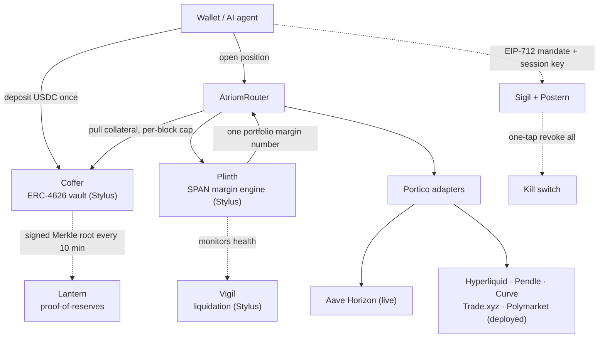

<div align="center">

<picture>
  <source media="(prefers-color-scheme: dark)" srcset="apps/verify/public/brand/assets/atrium-wordmark-dark-2x.png" />
  
</picture>

### Cross-venue portfolio margin, live on Arbitrum

**One wallet posts collateral once and trades across many onchain venues under a single margin number.**

[](https://www.useatrium.me)
[](#verification-everything-is-checkable)
[](#verification-everything-is-checkable)
[-3D5AFE?style=flat-square)](#how-it-works)
[](https://sepolia.arbiscan.io/address/0xc7bf0145371d3a79a9d43bab46dfee40f8a4aaf3)
[](./LICENSE)

[**Live demo**](https://www.useatrium.me) · [**Pitch**](https://www.useatrium.me/pitch) · [**Architecture**](https://www.useatrium.me/architecture) · [**Honest disclosures**](https://www.useatrium.me/docs/honesty)

</div>

---

**The whole product runs on one rule: you should not have to trust us. Click any address, re-run any test, verify any reserve.** Everything below is deployed and verifiable on **Arbitrum Sepolia** (and mirrored on **Robinhood Chain testnet**).

A hedged trader holds a $3M perp on one venue and $500K of T-bills as collateral on another. To stay hedged today they post margin on each venue **separately** and tie up capital twice. Atrium nets that hedge under one SPAN-style margin calculation, so the same risk frees about half the collateral.

## The number that matters

The `Plinth` engine returns **~51% of isolated margin freed** on a canonical equal-size hedge, locked by a unit test with a 40-70% guardrail band:

```bash
cargo test -p atrium-plinth span::hedge_frees_a_pinned_share_of_the_isolated_margin
```

That is not a slide. It is a passing test you can run. (The dollar figures above are an illustrative scale, not a live reading. No venue cross-margins across other venues today; Atrium is the substrate that does.)

## How it works



- **`Coffer`** (ERC-4626 vault, Stylus) holds collateral once. Approved orchestrators pull USDC up to a per-adapter, per-block cap, so a compromised adapter can drain at most ~1% of TVL per block.
- **`Plinth`** (SPAN margin engine, Stylus) computes one portfolio margin number across venues, netting correlated exposure. Dual oracle (Chainlink + Pyth), 50bps tolerance, 60s freshness on every price read.
- **`AtriumRouter`** opens a position across margin → vault → venue adapter in a single transaction.
- **`Sigil`** (EIP-712 mandates) + **`Postern`** (session keys) make AI agents first-class users, with capped, time-boxed delegations and a one-tap kill switch that revokes every mandate in a single batched tx.
- **`Vigil`** (Stylus) watches account health and soft-liquidates before a position goes underwater.
- **`Lantern`** publishes a signed Merkle root of share balances every 10 minutes; anyone can verify their balance locally without trusting Atrium.

The compute-heavy core (Plinth, Vigil, Coffer, Sigil) is written in **Arbitrum Stylus (Rust)**; the venue adapters and the Chainlink CCIP bridge are Solidity.

## Proof it's real

Every core contract is deployed and verified on Arbitrum Sepolia. Click and read the source.

| Contract | Role | Address |
|---|---|---|
| **Coffer** | ERC-4626 collateral vault | [`0xc7bf…aaf3`](https://sepolia.arbiscan.io/address/0xc7bf0145371d3a79a9d43bab46dfee40f8a4aaf3) |
| **Plinth** | SPAN margin engine | [`0xd86f…7553`](https://sepolia.arbiscan.io/address/0xd86f579ec880eaab27dfa698ae056d1893ec7553) |
| **Sigil** | Agent mandate registry | [`0xdba9…d6d9`](https://sepolia.arbiscan.io/address/0xdba97d39ff790e69c3526bb0c0b99a38f686d6d9) |
| **Vigil** | Liquidation engine | [`0x5ccd…deed`](https://sepolia.arbiscan.io/address/0x5ccd3422f430f6d034ff46715b41509de9d0deed) |
| **AtriumRouter** | Single-tx orchestrator | [`0xF593…35e0`](https://sepolia.arbiscan.io/address/0xF593e012196BDe8A58Ccdbf685f7A74fD3bD35e0) |
| **Lantern** | Proof-of-reserves attestor | [`0xF0B9…5888`](https://sepolia.arbiscan.io/address/0xF0B90b94C0B8a52c545768bFf06a3932c67d5888) |
| **Portico Registry** | Adapter whitelist | [`0x9a9a…40bc`](https://sepolia.arbiscan.io/address/0x9a9af6e50491cd4694699d48564bbff18f9b40bc) |
| **Praetor Timelock** | 48h timelock + multisig | [`0x0dad…22d4`](https://sepolia.arbiscan.io/address/0x0dad24d7feb2bb797e0f69e02c2f32104fcf22d4) |

Full address list (both chains): [`docs/deployment.md`](./docs/deployment.md).

And the money path is on-chain, not a mockup:

| Action | Transaction |
|---|---|
| Withdraw from vault | [`0x976e…ddbf`](https://sepolia.arbiscan.io/tx/0x976e098cad97978b4d34f5a0ddc85f48e03f023937d9a678485b530c3d4addbf) |
| Deposit (mobile) | [`0x8c8d…0347`](https://sepolia.arbiscan.io/tx/0x8c8d1f0ddf292bac321f0da5fe33115238ecfbe848ab56b1dee74a277b820347) |
| Proof-of-reserves root | `0x4b9e…ef1f0` (block 272828085, readable on [`/lantern`](https://www.useatrium.me/lantern)) |

## Verify it yourself in 60 seconds

Take none of this on faith. From a terminal:

```bash
# 1. The vault's real reserves, read straight from the contract (no Atrium server in the loop)
cast call 0xc7bf0145371d3a79a9d43bab46dfee40f8a4aaf3 "totalAssets()(uint256)" \
  --rpc-url https://sepolia-rollup.arbitrum.io/rpc

# 2. The same figure the app shows, from the public API
curl -s https://www.useatrium.me/api/vault/stats

# 3. The ~51% margin-saving headline, as a test you can run
cargo test -p atrium-plinth span::hedge_frees_a_pinned_share_of_the_isolated_margin
```

The contract read (6-decimal USDC) and the API's `vaultTvlUsd` are the same number. The test passes. That is the whole product in three commands, and not one of them touches a slide.

## What is live vs what is mocked

Atrium runs on a testnet, so this is stated plainly, the same way the live [`/docs/honesty`](https://www.useatrium.me/docs/honesty) page states it.

**Real on-chain today:** the vault (deposit/withdraw real USDC), the SPAN margin engine, the liquidation engine, agent mandates + kill switch, the Chainlink-keeper plumbing, and proof-of-reserves.

**Mocked or pending (testnet limits, not shortcuts):** of 7 deployed venue adapters, **1 (Aave Horizon) is operational** today, through an Atrium-deployed `MockAavePool` because Aave V3 has no usable Arbitrum Sepolia deployment. The other 6 adapters are deployed but scaffolded (their `open_position` reverts rather than strand funds) because the real venues have no testnet to integrate against. Cross-chain transfer (CCIP) and the tax service are pending external dependencies. Each gap is named, with a reason and an unlock date, on the honesty page.

## Quick start

```bash
git clone https://github.com/Pratiikpy/atrium.git atrium
cd atrium
make demo            # full local stack on Linux / macOS / WSL
# OR
make demo-frontend   # frontend only, works on Windows MSVC
```

No `make` (e.g. stock Windows)? Run Verifier Mode directly against the live testnet contracts:

```bash
cd apps/verify && pnpm install && pnpm dev   # then open http://localhost:3000
```

> **Precondition for the contracts:** the Stylus core (`plinth`, `coffer`, `sigil`, `vigil`) needs a linker that resolves Stylus WASM host symbols. Linux, macOS, and WSL work; Windows MSVC does not, so use `make demo-frontend` (or `pnpm dev`) on Windows.

## Verification: everything is checkable

| Suite | What it covers | Status |
|---|---|---|
| **Vitest** | 768 frontend + library tests | green |
| **Foundry** | 660+ Solidity contract + integration tests | green |
| **cargo** | Rust/Stylus unit + property tests (Coffer, Plinth, Sigil, Vigil) | green |
| **Kani** | 9 formal-verification proofs authored (CI lane lands Month 3) | in development |

```bash
make test     # run every suite
make kani     # run the formal-verification proofs
```

The frontend renders only real data: live RPC reads, Scribe (subgraph) queries, or signed sources. Where a value is not yet available it shows `pending` or an honest empty state, never a fabricated number.

## Repo layout

```text
atrium/
├── apps/verify/              # Verifier Mode (Next.js), the live app
├── contracts/
│   ├── plinth/               # SPAN margin engine        (Stylus / Rust)
│   ├── coffer/               # ERC-4626 collateral vault  (Stylus / Rust)
│   ├── sigil/                # Agent mandate registry     (Stylus / Rust)
│   ├── vigil/                # Liquidation engine         (Stylus / Rust)
│   ├── aqueduct/             # Cross-chain CCIP bridge    (Solidity)
│   ├── postern-kill-switch/  # AA emergency revoke        (Solidity)
│   ├── portico-registry/     # Adapter whitelist          (Solidity)
│   ├── praetor-timelock/     # Multisig + 48h timelock    (Solidity)
│   └── adapters/             # Per-venue Portico adapters
├── agents/                   # Reference agents (augur, haruspex, auspex)
├── services/                 # Off-chain: codex API, lantern attestor, keepers, CLI
├── subgraph/                 # The Graph indexer (Scribe)
├── tests/                    # Cross-package + adapter-conformance tests
├── docs/                     # Architecture, deployment, conventions
├── audits/  ·  incidents/  ·  runbooks/
└── resources/                # Cloned reference repos (see docs/resources.md)
```

## Tech stack

**Contracts:** Arbitrum Stylus (Rust) for the compute-heavy core · Solidity for adapters, CCIP, and governance · Foundry + cargo + Kani for verification.
**Off-chain:** Next.js 15 (Verifier Mode) · The Graph (Scribe indexer) · Chainlink CCIP + Pyth + Chainlink price feeds · x402-payable Codex API · GitHub Actions keepers.
**Agents:** EIP-712 mandates (Sigil) + ERC-4337 session keys (Postern) + ERC-8004 agent identity.

## Docs

| Doc | What it answers |
|---|---|
| [`docs/architecture.md`](./docs/architecture.md) | System architecture and security model |
| [`docs/deployment.md`](./docs/deployment.md) | Live URLs and every deployed address |
| [`docs/development.md`](./docs/development.md) | Local setup + cloned reference repos |
| [`docs/conventions/`](./docs/conventions/) | Security, testing, UI, writing, and git conventions |
| [`audits/`](./audits/) · [`incidents/`](./incidents/) · [`runbooks/`](./runbooks/) | Audits, post-mortems, ops procedures |

## Security

See [`SECURITY.md`](./SECURITY.md). Year-1 contracts are upgradeable via UUPS behind a 48-hour timelock. Admin today is a single founder deployer key; the production model is a 3-of-5 multisig behind the same timelock (Safe ceremony queued, see [`/docs/honesty`](https://www.useatrium.me/docs/honesty)). We say so out loud. Disclose vulnerabilities to `security@useatrium.me`.

## License

MIT for Atrium code, see [`LICENSE`](./LICENSE). Dependencies under `resources/` carry their own licenses (GPL-3.0 for EntryPoint, BUSL for Aave V3, etc.); integration only, no forking.

## Contributing

See [`CONTRIBUTING.md`](./CONTRIBUTING.md). The `IPorticoAdapter` interface is open: build an adapter for any venue, or contribute a reference agent. Pass the conformance tests in [`tests/adapter-conformance/`](./tests/adapter-conformance/) and open a PR.
