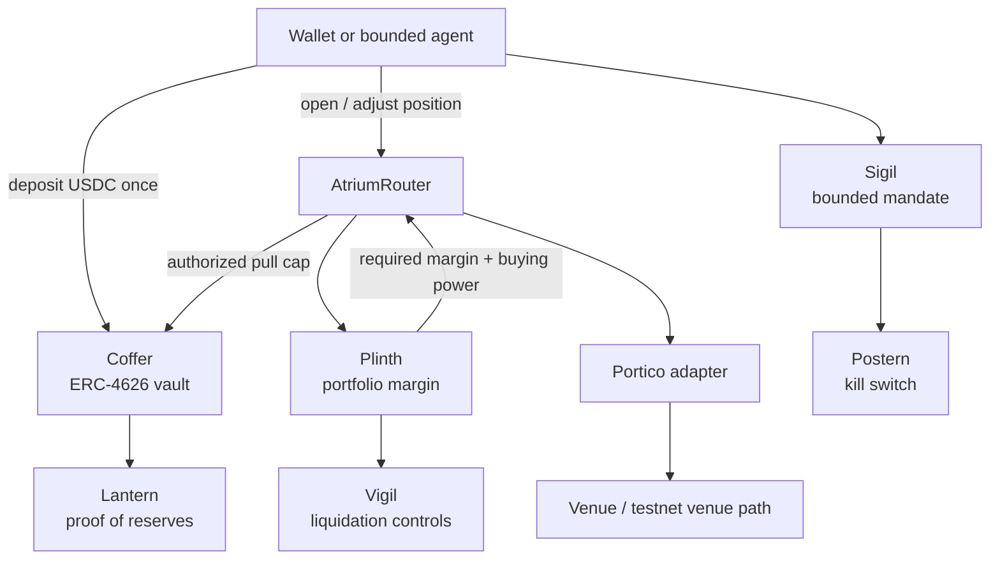

<div align="center">

<picture>
  <source media="(prefers-color-scheme: dark)" srcset="apps/verify/public/brand/assets/atrium-wordmark-dark-2x.png" />
  
</picture>

### Unified margin prime brokerage for the EVM

**Deposit collateral once. Trade across venues. Let one on-chain margin engine price the whole portfolio.**

[](https://www.useatrium.me)
[](./docs/deployment.md)
[](./deployments/robinhood_chain.json)
[](#why-stylus)
[](https://www.useatrium.me/lantern)
[](#what-is-live-today)
[](./LICENSE)

[Live demo](https://www.useatrium.me) | [Pitch](https://www.useatrium.me/pitch) | [Architecture](https://www.useatrium.me/architecture) | [Verifier](https://www.useatrium.me/verify) | [Honest disclosures](https://www.useatrium.me/docs/honesty)

<br />

[](https://www.useatrium.me/architecture)

<sub>Illustrative schematic. Live testnet values are read from contracts, APIs, or signed attestations and are labelled as such.</sub>

<br />
<br />

<table>
  <tr>
    <td align="center"><strong>Protocol</strong><br />Unified margin layer</td>
    <td align="center"><strong>Runtime</strong><br />Arbitrum Stylus + Solidity</td>
    <td align="center"><strong>Networks</strong><br />Arbitrum Sepolia + Robinhood Chain testnet</td>
    <td align="center"><strong>State</strong><br />Testnet only, verifiable</td>
  </tr>
  <tr>
    <td align="center"><strong>Core user flow</strong><br />Deposit, margin, delegate, revoke</td>
    <td align="center"><strong>Safety</strong><br />Caps, timelocks, kill switch</td>
    <td align="center"><strong>Data</strong><br />On-chain reads + signed roots</td>
    <td align="center"><strong>Limits</strong><br />Disclosed testnet workarounds</td>
  </tr>
</table>

</div>

---

## Start here

| If you are...       | Read this first                                                                                  |
| ------------------- | ------------------------------------------------------------------------------------------------ |
| A judge             | [Judge demo path](#judge-demo-path), then [Deployed proof](#deployed-proof)                      |
| A protocol engineer | [System map](#system-map), then [Why Stylus](#why-stylus)                                        |
| A security reviewer | [What is live today](#what-is-live-today), [Security](#security), [`SECURITY.md`](./SECURITY.md) |
| A contributor       | [Repository map](#repository-map), then [Contributing](#contributing)                            |

> **Testnet-only:** Atrium does not support real-value user funds today. The point of this build is to make the core protocol, margin math, wallet flows, and safety controls inspectable before mainnet.

## The problem

On-chain traders still manage risk in silos.

A wallet can hold a perp position on one venue, a yield or T-bill position on another, and spot collateral somewhere else. Each venue asks for its own margin, even when the positions offset each other. Capital gets locked twice because no neutral layer can see and price the portfolio as a whole.

Centralized prime brokers solve this for institutions. Atrium brings the same idea on-chain: one non-custodial collateral vault, one portfolio-wide margin number, and venue adapters that can use collateral only within explicit limits.

## The product

Atrium is a testnet-first unified-margin protocol deployed on Arbitrum Sepolia and Robinhood Chain testnet.

| Layer      | Component                  | What it does                                                                  |
| ---------- | -------------------------- | ----------------------------------------------------------------------------- |
| Collateral | `Coffer`                   | Holds USDC once in an ERC-4626 vault                                          |
| Margin     | `Plinth`                   | Computes SPAN-style portfolio margin in Arbitrum Stylus                       |
| Routing    | `AtriumRouter` + `Portico` | Routes positions through margin checks, vault permissions, and venue adapters |
| Agents     | `Sigil` + `Postern`        | Bounds delegated actions and revokes mandates/session keys                    |
| Risk       | `Vigil`                    | Handles liquidation queueing and execution controls                           |
| Reserves   | `Lantern`                  | Publishes signed proof-of-reserves roots                                      |
| Bridge     | `Aqueduct`                 | Provides the CCIP collateral bridge path                                      |

The user-facing promise is simple:

> One wallet posts collateral once, then receives a single margin number across supported venues.

## Why it matters

Atrium is not a generic trading UI. The wedge is structural.

A single venue cannot safely cross-margin a competitor's book without trusting that competitor's liquidation engine and extending credit against an external position. A neutral collateral and margin layer can do that job without asking one venue to subsidize another.

That is why prime brokerage exists outside individual exchanges in traditional finance. Atrium makes that role programmable, non-custodial, and verifiable on Arbitrum.

| Prime-brokerage property | Centralized prime broker | Single venue DeFi      | Atrium                       |
| ------------------------ | ------------------------ | ---------------------- | ---------------------------- |
| Cross-venue netting      | Yes                      | No                     | Yes, through a neutral layer |
| Custody model            | Custodial                | Venue-specific         | Non-custodial vault          |
| User-verifiable reserves | No                       | Partial                | Signed on-chain root         |
| Agent delegation         | Manual / off-chain       | Usually all-or-nothing | Bounded EIP-712 mandates     |

## Why Stylus

SPAN-style margin is compute-heavy: shock each instrument, net correlated exposures, and take the worst scenario. Running that math directly in Solidity is expensive enough to limit what can be done on-chain.

Atrium uses **Arbitrum Stylus with Rust** for the compute-heavy core:

| Contract | Runtime       | Role                               |
| -------- | ------------- | ---------------------------------- |
| `Plinth` | Stylus / Rust | SPAN-style portfolio margin engine |
| `Coffer` | Stylus / Rust | ERC-4626 collateral vault          |
| `Sigil`  | Stylus / Rust | EIP-712 mandate validation         |
| `Vigil`  | Stylus / Rust | Liquidation controls               |

Solidity is used where the ecosystem expects Solidity: routers, adapters, CCIP, registry, governance, and the kill switch.

## System map



## What is live today

Atrium is intentionally testnet-only. The goal is to make every claim inspectable before real value is supported.

| Surface                               | Status                                                                                                    |
| ------------------------------------- | --------------------------------------------------------------------------------------------------------- |
| Arbitrum Sepolia core protocol        | Deployed and wired                                                                                        |
| Robinhood Chain testnet core protocol | Deployed and wired                                                                                        |
| Vault deposit / withdraw              | Real testnet wallet flow                                                                                  |
| SPAN-style margin engine              | Deployed Stylus contracts plus tests                                                                      |
| Agent mandates and revoke flow        | Deployed mandate and kill-switch contracts                                                                |
| Proof of reserves                     | Signed root published on-chain                                                                            |
| Venue adapters                        | Deployed, with testnet limits disclosed                                                                   |
| Aave Horizon path                     | Operational through an Atrium testnet `MockAavePool` because Aave V3 is not available on Arbitrum Sepolia |
| Real economic funds                   | Not supported                                                                                             |

For the full list of mocks, relays, blocked upstreams, and production paths, see [`/docs/honesty`](https://www.useatrium.me/docs/honesty).

### Core flows

| Flow                 | What a user can verify now                   | Evidence surface                               |
| -------------------- | -------------------------------------------- | ---------------------------------------------- |
| Deposit collateral   | Wallet tx mints Coffer shares                | App vault flow + Arbiscan tx                   |
| Withdraw collateral  | Wallet tx redeems shares                     | App vault flow + Arbiscan tx                   |
| Read margin state    | Plinth-derived buying power and margin views | `/app/portfolio`, `/app/trade`, tests          |
| Inspect reserves     | Signed Lantern root and reserve dashboards   | `/lantern`, `/app/reserves`                    |
| Delegate to an agent | Bounded mandate surface                      | `/app/agents`, Sigil contract                  |
| Revoke delegation    | Kill-switch path                             | `/app/settings/session-keys`, Postern contract |
| Check limitations    | Every testnet workaround named               | `/docs/honesty`                                |

## Deployed proof

The generated deployment registry is the source of truth:

- [Arbitrum Sepolia deployment registry](./docs/deployment.md)
- [Robinhood Chain testnet deployment registry](./deployments/robinhood_chain.json)

Selected Arbitrum Sepolia contracts:

| Contract            | Role                              | Address                                                                                           |
| ------------------- | --------------------------------- | ------------------------------------------------------------------------------------------------- |
| `Coffer`            | ERC-4626 collateral vault         | [`0xb627...86ef`](https://sepolia.arbiscan.io/address/0xb62762000686a9589b01d63ba7e50f51f46a86ef) |
| `Plinth`            | Portfolio margin engine           | [`0xe01d...a26c`](https://sepolia.arbiscan.io/address/0xe01d09edcf889bf5577666f0aa61f5701c72a26c) |
| `Sigil`             | Agent mandate registry            | [`0x517a...9cdc`](https://sepolia.arbiscan.io/address/0x517afac9b39c01c0cf044b335742c95960959cdc) |
| `Vigil`             | Liquidation controls              | [`0x5e09...a194`](https://sepolia.arbiscan.io/address/0x5e099faf4fbc70832ea5e12178a9f9dec96ba194) |
| `AtriumRouter`      | Margin to vault to adapter router | [`0xE3E3...B562`](https://sepolia.arbiscan.io/address/0xE3E3bdc0B7FC9eC93fb0d6190A98ec1717B0B562) |
| `LanternAttestor`   | Proof-of-reserves attestor        | [`0xF0B9...5888`](https://sepolia.arbiscan.io/address/0xF0B90b94C0B8a52c545768bFf06a3932c67d5888) |
| `PosternKillSwitch` | One-tx revoke path                | [`0xCD89...b0b7`](https://sepolia.arbiscan.io/address/0xCD899f715462A33Ae880310d72b37bde102ab0b7) |

Example on-chain money-path transactions:

| Action                       | Transaction                                                                                                          |
| ---------------------------- | -------------------------------------------------------------------------------------------------------------------- |
| Deposit from the mobile flow | [`0x8c8d...0347`](https://sepolia.arbiscan.io/tx/0x8c8d1f0ddf292bac321f0da5fe33115238ecfbe848ab56b1dee74a277b820347) |
| Withdraw from Coffer         | [`0x976e...ddbf`](https://sepolia.arbiscan.io/tx/0x976e098cad97978b4d34f5a0ddc85f48e03f023937d9a678485b530c3d4addbf) |

## Verify it yourself

These checks avoid screenshots and marketing copy. They read the deployed system.

```bash
# 1. Read Coffer's testnet reserves directly from Arbitrum Sepolia.
cast call 0xb62762000686a9589b01d63ba7e50f51f46a86ef "totalAssets()(uint256)" \
  --rpc-url https://arbitrum-sepolia.publicnode.com

# 2. Compare with the public app API.
curl -s https://www.useatrium.me/api/vault/stats

# 3. Run the pinned margin-saving test.
cd contracts/plinth
cargo test hedge_frees_a_pinned_share_of_the_isolated_margin -- --nocapture
```

The margin test checks a canonical equal-size hedge and guards the expected saving band. The illustrative dollar examples in the product are labelled as examples, not live measured capital.

## Judge demo path

For a fast evaluation, use the hosted app:

1. Open [`useatrium.me`](https://www.useatrium.me).
2. Connect a test wallet on Arbitrum Sepolia.
3. Claim testnet funds from the faucet if needed.
4. Deposit USDC into Coffer.
5. View portfolio, margin, reserves, and deployment status.
6. Walk the Verifier route at [`/verify`](https://www.useatrium.me/verify).
7. Issue or inspect an agent mandate.
8. Revoke active delegations with the kill switch.
9. Open [`/docs/honesty`](https://www.useatrium.me/docs/honesty) to see every testnet limitation.

The project should be judged as a deployed testnet protocol, not as a mainnet venue with real economic funds.

## Local development

```bash
git clone https://github.com/Pratiikpy/atrium.git atrium
cd atrium
pnpm install
pnpm dev
```

Then open `http://localhost:3000`.

For the full local stack on Linux, macOS, or WSL:

```bash
make demo
```

On stock Windows, use the frontend path:

```bash
make demo-frontend
```

The Stylus contracts require a toolchain that can link Stylus WASM host symbols. Linux, macOS, and WSL are the reliable contract-development environments.

## Verification

```bash
pnpm --filter @atrium/verify type-check
pnpm --filter @atrium/verify test
forge test
cargo test --workspace
node scripts/run-kani.mjs
```

Full repo check:

```bash
make test
```

The frontend follows an honesty rule: a displayed number is either live, signed, derived from a named source, or clearly marked as pending / illustrative / unavailable.

## Repository map

```text
atrium/
├── apps/verify/              # Next.js app and verifier surface
├── contracts/
│   ├── plinth/               # Portfolio margin engine, Stylus / Rust
│   ├── coffer/               # ERC-4626 collateral vault, Stylus / Rust
│   ├── sigil/                # EIP-712 mandate registry, Stylus / Rust
│   ├── vigil/                # Liquidation controls, Stylus / Rust
│   ├── aqueduct/             # Chainlink CCIP bridge, Solidity
│   ├── postern-kill-switch/  # Emergency revoke path, Solidity
│   ├── portico-registry/     # Adapter registry, Solidity
│   └── adapters/             # Venue adapters
├── agents/                   # Reference agents
├── services/                 # Codex API, Lantern attestor, keepers, notifier, tablet
├── subgraph/                 # Scribe indexer
├── tests/                    # Integration and adapter-conformance tests
├── docs/                     # Architecture, deployment, development docs
├── audits/                   # Security and quality review notes
└── runbooks/                 # Operational procedures
```

## Documentation

| Document                                                                 | Purpose                                             |
| ------------------------------------------------------------------------ | --------------------------------------------------- |
| [`PITCH.md`](./PITCH.md)                                                 | The product thesis and judge-facing narrative       |
| [`ARCHITECTURE.md`](./ARCHITECTURE.md)                                   | Full system architecture and deployment map         |
| [`docs/deployment.md`](./docs/deployment.md)                             | Generated Arbitrum Sepolia deployment registry      |
| [`deployments/robinhood_chain.json`](./deployments/robinhood_chain.json) | Robinhood Chain testnet deployment registry         |
| [`docs/development.md`](./docs/development.md)                           | Local setup and development notes                   |
| [`docs/conventions/`](./docs/conventions/)                               | Security, testing, UI, writing, and git conventions |
| [`SECURITY.md`](./SECURITY.md)                                           | Responsible disclosure policy                       |

## Security

Atrium is testnet-only and does not support real-value user funds. Contracts are upgradeable during testnet development. Sensitive controls, governance assumptions, and testnet limitations are disclosed in the public docs rather than hidden behind marketing copy.

Report vulnerabilities to [`security@useatrium.me`](mailto:security@useatrium.me). For sensitive reports, use a confidential GitHub Security Advisory.

## Contributing

The `IPorticoAdapter` interface is open. Build an adapter for a venue, contribute a reference agent, or improve the verifier surface. Adapter contributions should pass the conformance tests in [`tests/adapter-conformance/`](./tests/adapter-conformance/).

## License

Atrium code is MIT licensed. See [`LICENSE`](./LICENSE). Third-party dependencies and cloned reference repositories under `resources/` retain their original licenses.
