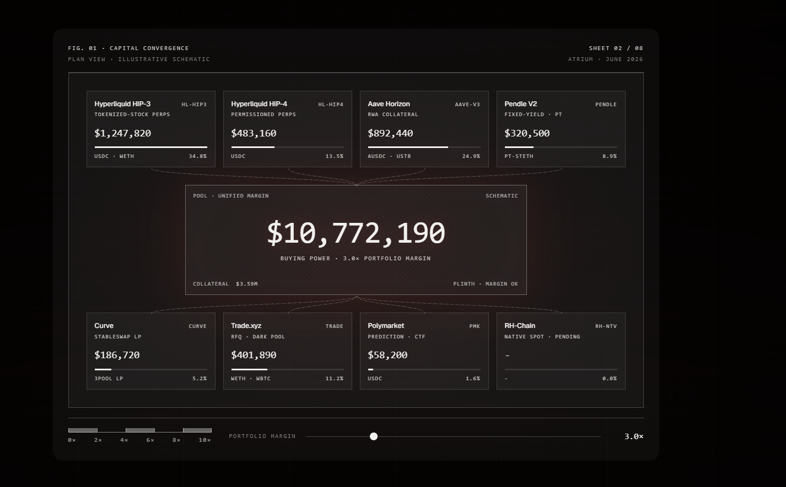
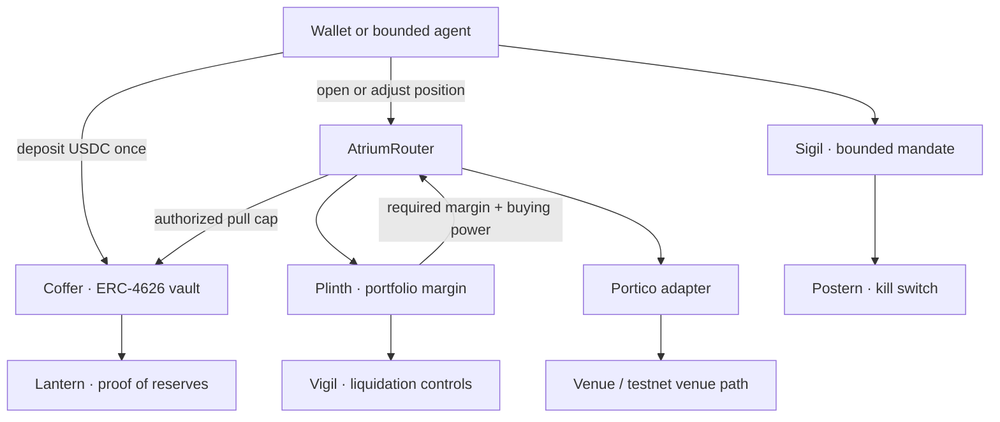

<div align="center">

<picture>
  <source media="(prefers-color-scheme: dark)" srcset="apps/verify/public/brand/assets/atrium-wordmark-dark-2x.png" />
  
</picture>

### The prime broker no single venue can be for itself.

Post collateral once. Hedge across venues. One on-chain engine prices the whole book and frees the margin your hedge already earned you.

[](https://www.useatrium.me)
[](./docs/deployment.md)
[](./deployments/robinhood_chain.json)
[](#why-the-engine-runs-in-rust)
[](https://www.useatrium.me/lantern)
[](https://sourcify.dev)
[](#what-is-live-what-is-mocked)

**[Open the app](https://www.useatrium.me)** · [Demo video](https://youtu.be/LliZ3DdxF3E) · [Pitch video](https://youtu.be/ZckBcF9dSs4) · [Judge brief (Notion)](https://comfortable-goal-205.notion.site/Atrium-37b9c0ce7876809387c7c1a6cd95ae0e) · [Proof deck](https://www.useatrium.me/proof-deck.html) · [Pitch deck](https://www.useatrium.me/pitch) · [Architecture](https://www.useatrium.me/architecture) · [Verifier](https://www.useatrium.me/verify) · [What is mock, what is real](https://www.useatrium.me/docs/honesty)

<br />

[](https://www.useatrium.me/architecture)

<sub>Illustrative schematic. Every live value in the product is read from a contract, an API, or a signed attestation, and labelled as such.</sub>

</div>

---

## Read this in 30 seconds

A trader who is long perps on one venue and long tokenized T-bills on another is hedged. The risk is lower. Yet every venue today computes margin in its own silo and asks for collateral as if the account were a single one-sided bet. The hedge is real. The margin engine cannot see it. So capital is posted twice and sits idle.

Atrium is the neutral layer that sees the whole book. You deposit USDC once into one vault. A SPAN-style scenario-grid engine, written in Rust and running on Arbitrum Stylus, nets correlated risk across every venue you hold and returns one margin number per block. It does for on-chain traders what a prime broker does for a hedge fund, without custody and without asking one venue to extend credit against a competitor's book.

Two things make this real rather than a pitch:

1. **A netting number that cannot drift from a slide.** A hedged book that costs `$20,400` margined leg by leg costs `$10,000` netted as one portfolio. That is **51.0% freed**, and a test in CI guards the engine's netting so this figure cannot silently weaken. [Jump to it.](#one-book-one-number)
2. **An AI agent that acts on-chain, and a risk engine that tells it no.** A user signs one bounded mandate. The agent opens a trade inside it. The next action breaks the cap and the contract reverts. Four real transactions you can open right now. [Jump to it.](#an-agent-with-a-key-and-a-limit)

---

## Do not trust this page. Check it.

Atrium's product is verifiability, so the README earns its claims before it makes them. Three commands, no wallet, about a minute.

```bash
# 1. Read the vault's testnet reserves straight from Arbitrum Sepolia.
cast call 0xb62762000686a9589b01d63ba7e50f51f46a86ef "totalAssets()(uint256)" \
  --rpc-url https://arbitrum-sepolia.publicnode.com

# 2. Ask the public app for the same number. They should agree.
curl -s https://useatrium.me/api/vault/stats

# 3. Run the SPAN netting invariant. The figure comes from the engine, not a slide.
cd contracts/plinth && cargo test hedge_frees_a_pinned_share_of_the_isolated_margin -- --nocapture
```

When you are done here, [`/verify`](https://www.useatrium.me/verify) walks seven claims the same way, and [`/docs/honesty`](https://www.useatrium.me/docs/honesty) names every mock, relay, and testnet workaround in the system.

---

## The bug everyone in DeFi shipped

Single-venue cross-margin is solved. Hyperliquid, dYdX, and Drift all net positions inside their own exchange. The gap is between venues.

No venue can safely cross-margin a competitor's book, because doing so means trusting that competitor's liquidation engine and extending credit against a position it does not control. This is not a missing feature. It is a conflict of interest baked into the venue model. Traditional finance solved it the same way: prime brokerage lives **outside** any single exchange.

Atrium is that outside layer, made programmable and non-custodial.

| Property | Centralized prime broker | Single-venue DeFi | Atrium |
| --- | --- | --- | --- |
| Cross-venue netting | Yes | No | Yes, from a neutral layer |
| Custody | Custodial | Venue-held | Non-custodial vault |
| Reserves you can check | No | Partial | Signed on-chain root |
| Agent delegation | Off-chain, manual | All-or-nothing | Bounded EIP-712 mandates |

---

## One book, one number

This is the whole thesis in one screen, and it is live at [`/app/portfolio`](https://www.useatrium.me/app/portfolio) as the Margin Lens panel.

Take a classic hedge: long $100k of one perp, short $100k of a correlated perp. Margined the way venues do it today, each leg is priced alone and the costs add up. Margined as one portfolio, the scenario grid sees that a shock which hurts one leg helps the other.

| Same book, two ways to margin it | Initial margin |
| --- | --- |
| Each leg priced alone, summed (what venues charge you today) | `$20,400` |
| Netted as one portfolio by Plinth | `$10,000` |
| **Freed by netting** | **51.0%** |

The number is a worked example, labelled as one in the product, and it is locked by `hedge_frees_a_pinned_share_of_the_isolated_margin` in `contracts/plinth`. If someone changes the engine and the saving drifts, CI goes red. The invariant underneath, that a hedged book never requires more margin than its legs do alone, is locked by that property test on every commit; the adjacent solvency and notional-monotonicity invariants are Kani-verified in `contracts/plinth/src/span.rs`.

A slide can claim any number. A test that runs on every commit cannot.

---

## An agent with a key and a limit

Atrium treats an AI agent as a first-class user that is never trusted further than its signed mandate. A user signs one EIP-712 `IntentSigil`: a per-action cap, a daily count, an expiry, a venue allowlist. A separate agent session key signs each trade. The Stylus risk engine checks every action against the mandate before any value moves.

The enforcement was captured end to end on Arbitrum Sepolia. Open any row.

| Step | What the agent did | On-chain outcome | Transaction |
| --- | --- | --- | --- |
| 1 | Opened a 2 USDC trade, inside the 5 USDC cap | Position 11 opened, owned by the **user** | [`0xd198d4e8`](https://sepolia.arbiscan.io/tx/0xd198d4e8c60d00e2ac4ca1028a03636029d4617622b5a47971724cd5f0ea678f) |
| 2 | Tried a 10 USDC trade, over the cap | Reverts `NotionalExceeded(10000000, 5000000)` | [`0x73859be8`](https://sepolia.arbiscan.io/tx/0x73859be872fc3cbf4a59fb6df0af7471c61a03108099962adcbebda8272c47de) |
| 3 | (User) fired the kill switch | Agent revoked, nonce 0 to 1 | [`0x65e24e9a`](https://sepolia.arbiscan.io/tx/0x65e24e9a9cebf66254e08081e520e657bb415b00f344b15b6d5386c3eed848d6) |
| 4 | Tried to act after revocation | Reverts `MandateRevoked` | [`0x41bf9904`](https://sepolia.arbiscan.io/tx/0x41bf9904886c05a160291194d91dc346028b378981082f2b7227ee9f656551e3) |

The successful trade is attributed to the user, not the agent: agent-authorized execution, not agent custody. The session key never holds funds and never carries authority past the signed caps. Each of the four steps above is a live transaction on Arbitrum Sepolia; click any hash to inspect it on Arbiscan. The same flow is surfaced for judges at [`/app/agents`](https://www.useatrium.me/app/agents).

---

## Why the engine runs in Rust

SPAN-style margin is heavy work: shock every instrument across a scenario grid, net correlated exposures, take the worst case. In plain Solidity that math is expensive enough to push it off-chain, which is exactly where trust goes to hide.

Atrium keeps it on-chain by writing the hot path in Rust on Arbitrum Stylus.

| Contract | Runtime | Role |
| --- | --- | --- |
| `Plinth` | Rust / Stylus | SPAN-style portfolio margin engine |
| `Coffer` | Rust / Stylus | ERC-4626 collateral vault |
| `Sigil` | Rust / Stylus | EIP-712 mandate validation |
| `Vigil` | Rust / Stylus | Liquidation controls |

Solidity stays where the ecosystem expects it: routers, venue adapters, the CCIP bridge, the registry, governance, and the kill switch.

---

## System map



| Layer | Component | Job |
| --- | --- | --- |
| Collateral | `Coffer` | Holds USDC once, mints ERC-4626 shares |
| Margin | `Plinth` | SPAN-style portfolio margin, in Stylus |
| Routing | `AtriumRouter` + `Portico` | Margin check, vault permission, venue adapter |
| Agents | `Sigil` + `Postern` | Bounds delegated actions, revokes them |
| Risk | `Vigil` | Liquidation queueing and execution control |
| Reserves | `Lantern` | Publishes signed proof-of-reserves roots |
| Bridge | `Aqueduct` | Chainlink CCIP collateral path |

---

## What is live, what is mocked

Atrium is testnet-only on purpose. The goal is to make every claim inspectable before real value is ever at stake. Honesty is the brand, so the limits are in the README, not buried.

| Surface | State |
| --- | --- |
| Core protocol on Arbitrum Sepolia | Deployed and wired |
| Core protocol on Robinhood Chain testnet (chainId 46630) | Deployed and wired |
| Deposit and withdraw | Real testnet wallet flow, real Arbiscan transactions |
| SPAN-style margin engine | Deployed Stylus contracts, plus tests and Kani proofs |
| Agent mandates, enforcement, revoke | Deployed, proven on-chain (see the table above) |
| Proof of reserves | Signed Merkle root published on-chain by `Lantern` |
| Venue adapters | Deployed, with each testnet limit named |
| Aave Horizon path | Runs through an Atrium `MockAavePool`, because Aave V3 is not on Arbitrum Sepolia |
| Governance | Deployer-admin on the live testnet stack. A 3-of-5 Safe plus 48h timelock is the documented pre-mainnet gate, and the code exists |
| Real economic funds | Not supported |

The honest challenge to a reviewer: Atrium makes seven claims, each checkable on Arbiscan, and every mock is named at [`/docs/honesty`](https://www.useatrium.me/docs/honesty). Find one fabricated number.

---

## Deployed proof

The generated registries are the source of truth: [Arbitrum Sepolia](./docs/deployment.md) and [Robinhood Chain testnet](./deployments/robinhood_chain.json).

**Arbitrum Sepolia**

| Contract | Role | Address |
| --- | --- | --- |
| `Coffer` | ERC-4626 collateral vault | [`0xb627...86ef`](https://sepolia.arbiscan.io/address/0xb62762000686a9589b01d63ba7e50f51f46a86ef) |
| `Plinth` | Portfolio margin engine | [`0xe01d...a26c`](https://sepolia.arbiscan.io/address/0xe01d09edcf889bf5577666f0aa61f5701c72a26c) |
| `Sigil` | Agent mandate registry | [`0x517a...9cdc`](https://sepolia.arbiscan.io/address/0x517afac9b39c01c0cf044b335742c95960959cdc) |
| `Vigil` | Liquidation controls | [`0x5e09...a194`](https://sepolia.arbiscan.io/address/0x5e099faf4fbc70832ea5e12178a9f9dec96ba194) |
| `AtriumRouter` | Margin to vault to adapter | [`0xE3E3...B562`](https://sepolia.arbiscan.io/address/0xE3E3bdc0B7FC9eC93fb0d6190A98ec1717B0B562) |
| `LanternAttestor` | Proof-of-reserves attestor | [`0xF0B9...5888`](https://sepolia.arbiscan.io/address/0xF0B90b94C0B8a52c545768bFf06a3932c67d5888) |
| `PosternKillSwitch` | One-transaction revoke | [`0xCD89...b0b7`](https://sepolia.arbiscan.io/address/0xCD899f715462A33Ae880310d72b37bde102ab0b7) |

**Robinhood Chain testnet (chainId 46630).** The full core stack, mirrored on the chain tokenized equities will trade on.

| Contract | Address |
| --- | --- |
| `Plinth` | `0xa08ba28ef31658df67e874dd2bf8a2b2d34597fa` |
| `Coffer` | `0x71d872bd76738887415439a7fc0a1acbc4218fbc` |
| `Sigil` | `0xede8444c622b8ae28364e86784749744bd0a1c23` |
| `AtriumRouter` | `0xB90a51A726740065BD0DbC20cD79306b30D8b676` |

**Money-path transactions you can open**

| Action | Transaction |
| --- | --- |
| Deposit into Coffer | [`0x8c8d...0347`](https://sepolia.arbiscan.io/tx/0x8c8d1f0ddf292bac321f0da5fe33115238ecfbe848ab56b1dee74a277b820347) |
| Withdraw from Coffer | [`0x976e...ddbf`](https://sepolia.arbiscan.io/tx/0x976e098cad97978b4d34f5a0ddc85f48e03f023937d9a678485b530c3d4addbf) |

Eight venue adapters carry an `exact_match` verification on [Sourcify](https://sourcify.dev), with the Aave Horizon adapter verified on Arbiscan (Aave V3 is not on Arbitrum Sepolia); the Solidity core contracts (router, registry, attestor, kill-switch, timelock) are also `exact_match` on Sourcify. The Stylus engine (Plinth, Coffer, Sigil, Vigil) is verified via `cargo stylus verify`, which Sourcify does not yet support. Paste any address above to read the source against the deployed bytecode.

---

## Run it locally

```bash
git clone https://github.com/Pratiikpy/atrium.git atrium
cd atrium
pnpm install
pnpm dev          # then open http://localhost:3000
```

Full local stack on Linux, macOS, or WSL:

```bash
make demo
```

Frontend-only on stock Windows:

```bash
make demo-frontend
```

The Stylus contracts need a toolchain that links the Stylus WASM host symbols. Linux, macOS, and WSL are the reliable environments for contract work.

### Verify the build

```bash
pnpm --filter @atrium/verify type-check
pnpm --filter @atrium/verify test
forge test
cargo test --workspace
node scripts/run-kani.mjs
```

The frontend follows one rule: a number on screen is live, signed, derived from a named source, or clearly marked as pending, illustrative, or unavailable. Nothing in between.

---

## Repository map

```text
atrium/
├── apps/verify/              # Next.js app and the verifier surface
├── contracts/
│   ├── plinth/               # Portfolio margin engine        Rust / Stylus
│   ├── coffer/               # ERC-4626 collateral vault       Rust / Stylus
│   ├── sigil/                # EIP-712 mandate registry        Rust / Stylus
│   ├── vigil/                # Liquidation controls            Rust / Stylus
│   ├── aqueduct/             # Chainlink CCIP bridge           Solidity
│   ├── postern-kill-switch/  # Emergency revoke path           Solidity
│   ├── portico-registry/     # Adapter registry                Solidity
│   └── adapters/             # Venue adapters
├── agents/                   # Reference agents
├── services/                 # Codex API, Lantern attestor, keepers, notifier, tablet
├── subgraph/                 # Scribe indexer
├── tests/                    # Integration and adapter-conformance tests
├── docs/                     # Architecture, deployment, conventions
├── audits/                   # Security and quality review notes
└── runbooks/                 # Operational procedures
```

---

## For different readers

| You are | Start here |
| --- | --- |
| A judge | [Read this in 30 seconds](#read-this-in-30-seconds), then [Do not trust this page](#do-not-trust-this-page-check-it) |
| A protocol engineer | [Why the engine runs in Rust](#why-the-engine-runs-in-rust), then [System map](#system-map) |
| A security reviewer | [What is live, what is mocked](#what-is-live-what-is-mocked), [`SECURITY.md`](./SECURITY.md) |
| A builder | [`IPorticoAdapter`](./tests/adapter-conformance/) and [Contributing](#contributing) |

## Documentation

| Document | Purpose |
| --- | --- |
| [`PITCH.md`](./PITCH.md) | Product thesis and judge-facing narrative |
| [`ARCHITECTURE.md`](./ARCHITECTURE.md) | Full system architecture and deployment map |
| [`docs/deployment.md`](./docs/deployment.md) | Generated Arbitrum Sepolia registry |
| [`deployments/robinhood_chain.json`](./deployments/robinhood_chain.json) | Robinhood Chain testnet registry |
| [`docs/conventions/`](./docs/conventions/) | Security, testing, UI, writing, and git conventions |
| [`SECURITY.md`](./SECURITY.md) | Responsible disclosure policy |

## Security

Atrium is testnet-only and supports no real-value funds. Contracts are upgradeable during testnet development. Governance assumptions and every testnet limitation sit in the public docs, not behind marketing copy. Report vulnerabilities to [`security@useatrium.me`](mailto:security@useatrium.me), or through a confidential GitHub Security Advisory for sensitive reports.

## Contributing

The `IPorticoAdapter` interface is open. Write an adapter for a venue, contribute a reference agent, or sharpen the verifier surface. Adapter contributions pass the conformance tests in [`tests/adapter-conformance/`](./tests/adapter-conformance/).

## License

MIT, see [`LICENSE`](./LICENSE). Third-party dependencies and the cloned reference repositories under `resources/` keep their original licenses.

<div align="center"><br /><sub>Built on Arbitrum. Testnet only. Verify everything.</sub></div>
